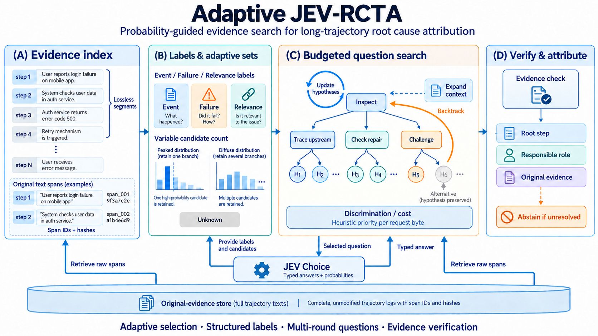

# Adaptive JEV-RCTA 使用与实现

本文记录 v1 历史实现。2026-09-24 的 Mini 测试因持续弃答被用户停止；当前优化版的流程、输出定义和入口见 [Adaptive RCTA v2](ADAPTIVE_RCTA_V2.md)。

协议：`jev-rcta-adaptive-v1`。独立于历史 `jev-rcta-choice-v2`。仅使用 Python 标准库和现有 JEV Choice 传输接口。

这是依据[文献研究](../reports/jev_rcta_literature_design_20260924.md)实现的工程原型。默认阈值未经任务校准，问题调度是成本感知启发式；不声称复现 EC² 的理论最优性、CBM/Self-RAG 的训练过程或整棵搜索树的覆盖率保证。

## 已实现的流程

1. **无损证据索引**：轨迹按消息和交接边界、字节上限组织为 segment；超长步骤拆成有 UTF-8 字节边界和 SHA-256 的原文片段。转义字符也计入序列化预算。原文不以摘要替代。
2. **标签与自适应集合**：每段批量回答事件、异常现象、相关性和证据位置。根据同一问题内完整概率分布，保留达到质量阈值的候选并保留边界同概率选项，不设置固定 top-k。明确无关的段暂缓，可以重新打开。
3. **问题控制器**：根据当前标签选择检查、展开本步、检索上游、检查后续修复或寻找反证。优先级是预设判别价值与预计请求字节的比值，并随提示需求和已读页数更新，不是假装已知的信息增益。
4. **逐轮补证与回溯**：检索器扫描所有符合方向的原文片段，以词项匹配、明确接收者和验证线索排序；不同页排除已读片段。有支持的上游假设加入候选，有直接修复/反证的分支暂缓，控制器返回其他候选。所有模型关系仍标为假设。
5. **独立归因与核验**：根因步骤和责任角色分别选择；随后另一轮读取原文核验所选步骤。证据检查未完成、选择不确定或预算不足时，`predicted_step` 为 null；暂定候选如存在保存在 `tentative_step`，不冒充有效预测。

相互独立的问题可同轮发送，有先后依赖的问题分轮发送。同一证据的重复判断不作为独立概率相乘。超大候选集按请求空间分组后仍保留自适应集合；如果无法进一步缩减则明确弃答。

## 文件入口

| 文件 | 职责 |
|---|---|
| `scripts/rcta_evidence.py` | 原文索引、完整性审计、分页检索 |
| `scripts/rcta_choice_policy.py` | Choice 分布校验、自适应集合、离线集合阈值校准 |
| `scripts/jev_rcta_adaptive.py` | 多轮控制器、预算、回溯、最终核验 |
| `scripts/evaluate_jev_rcta_adaptive.py` | 离线/真实运行、连接预检、断点恢复、评分 |
| `scripts/rcta_demo.py` | 确定性的合成演示回复，不是模型 |
| `tests/test_rcta_adaptive.py` | 行为、故障和数据泄漏检查 |

调用库接口：`predict(history, client, config=None, calibration=None)`，只传历史记录。人工根因与解释不进入模型输入；评测入口在推理结束后读取标签评分。

## 离线运行

```bash
python3 -m unittest discover -s tests -p 'test_rcta_adaptive.py' -v
python3 scripts/evaluate_jev_rcta_adaptive.py --demo --output results/jev_rcta_adaptive_demo_v1
python3 scripts/evaluate_jev_rcta_adaptive.py --audit-only --mini --output results/jev_rcta_adaptive_audit_v1
```

`--demo` 使用写好的合成回复，演示从执行者追溯到错误指令、回退传播分支并核验原文的流程。它不读取密钥，不调用网络，也不能证明 JEV 的实际准确率。

`--audit-only --mini` 对本地固定版本的 200 条 Mini 检查逐字节原文覆盖。每个片段都可还原到原始步骤并验证哈希；该检查不代表模型已读取或理解全部原文。

## 真实 API 运行

只在确实准备消耗 API 额度时使用 `--live`。密钥沿用环境变量 `TYPESAFE_API_KEY` / `JEV_API_KEY` 或私有 `.env`。当前端点沿用官方直连，模型固定为 `jev-1.13.0`。

```bash
# 默认先选每个来源最短的一条，共 5 条；不按答案标签挑选。
python3 scripts/evaluate_jev_rcta_adaptive.py --live --output results/jev_rcta_adaptive_smoke

# 另起目录运行 Mini；不要将 smoke 和 mini 混在同一个目录。
python3 scripts/evaluate_jev_rcta_adaptive.py --live --mini --output results/jev_rcta_adaptive_mini

# 也可以通过 --case-id 精确选取某条本地 Mini 样本。
```

真实运行首先执行小型 Choice 连接测试，检查答案和概率分布一致性。任何连接预检失败或轨迹请求错误均停止后续运行，成功调用已保存。遇到额度不足沿用持久 `balance_stop.json`，立即停止新请求，不能自动更换密钥或消除停止标记。

同一命令可恢复：请求、模型和端点必须完全匹配；输出目录还冻结代码、数据、样本选择、配置和校准文件。改变任意一项应使用新目录。离线演示目录不能用于真实实验。

## 默认预算与实际含义

| 参数 | 默认值 | 含义 |
|---|---:|---|
| `span_bytes` | 2200 | 单个原文片段的原始 UTF-8 字节上限，还检查 JSON 序列化大小 |
| `segment_bytes` | 32000 | 粗读段的序列化预算；细粒度原文指针仍独立保留 |
| `segment_records` | 64 | 每段最多包含的原文片段数，非候选保留数量 |
| `evidence_bytes` | 10000 | 每轮目标与补充证据的预算 |
| `request_bytes` | 62000 | 完整请求发送前的字节上限 |
| `max_calls` | 64 | 每条轨迹的逻辑请求上限，包含重放 |
| `max_request_bytes` | 1600000 | 每条轨迹累计逻辑请求字节上限 |
| `max_input_tokens` | 300000 | 收到响应后检查的累计输入 token 上限 |
| `max_rounds` | 24 | 搜索动作上限；不包含粗读与最终核验 |
| `selection_mass` | 0.9 | 未校准时的累计质量启发式阈值 |
| `decision_threshold` | 0.8 | 未校准的强判断阈值；不是保证正确率 |

这些是可见的工程预算，不是 JEV 官方 tokenizer 的精确上下文保证。传输可能对临时错误进行有界重试，一次逻辑请求最多产生四次网络尝试；没有收到响应的调用也可能被服务端计费。token 上限在收到响应后检查，因此最后一次请求可能越过该 token 上限；请求字节上限在发送前检查。

可通过 `--config path/to/config.json` 覆盖字段。粗读与搜索会为最终判断预留预算；预留按每次最大请求字节计，比较保守。长轨迹可能在完成粗读前耗尽预算，此时不能输出已核验根因。应先观察小样本的 `decision_reason` 和预算用量，再决定是否调整，而不是直接把弃答理解成模型能力下降。

## 可选的集合阈值校准

默认不使用 Mini 标签调阈值。可以准备独立开发轨迹上的人工标注 Choice 问题，一行一个 JSON：

```json
{"case_id":"heldout-dev-001","kind":"location","answer":{"choice":"s1:0:10","probabilities":{"s1:0:10":0.8,"unknown":0.2}},"truth":"s1:0:10"}
```

```bash
python3 scripts/rcta_choice_policy.py --input dev_questions.jsonl --output calibration.json --alpha 0.1
python3 scripts/evaluate_jev_rcta_adaptive.py --live --calibration calibration.json --output results/jev_rcta_adaptive_calibrated_smoke
```

支持的使用点是 `location`、`citation` 和 `root_step`。每个题型使用累计概率排名分数的有限样本分位数；同概率选项整体保留，阈值 1 保留全部选项。每个 `(case_id, kind)` 仅允许一条标注，评测入口拒绝校准集和评估集存在相同轨迹 ID。

校准文件记录题型、轨迹 ID、样本数、最大概率均值、top-1 正确率与 Brier 分数。小校准集可能给出保留全部选项的阈值，这是保守行为。它校准集合选择，尚不拟合温度或问题收益模型。即使按此计算，也只有在相应交换性与问题采样条件成立时才能讨论题级覆盖；不能推导整棵自适应搜索树的覆盖率。

## 输出与核查

- `config.json`：完整冻结配置和代码摘要。
- `calls/<case-id>/`：原始请求、响应、精确请求摘要和传输重试记录。
- `predictions/<case-id>.json`：标签卡、候选集合、搜索节点、动作序列、关系假设、最终证据指针、弃答原因与预算。
- `preflight.json`：连接测试结果及其单独用量。
- `summary.json`：全部选定样本为分母的指标；弃答按缺失步骤计错，并单独报告弃答数和各阶段候选召回。
- `response_warnings`：例如服务返回的 `choice` 不是概率最大项。保留原始返回字段，控制器明确使用归一化分布最大项；不静默强制把返回选择排在第一。

不使用过时单价估算费用；报告实际返回的 token 用量。模型给出的标签、置信度或关系都不等同于外部验证的因果事实。

## 论文主图



主图由内置 imagegen 生成，保存为 PNG。生成与修订提示词分别保存在 `figures/jev-rcta-adaptive-main-prompt.txt` 和 `figures/jev-rcta-adaptive-main-edit-prompts.txt`。图中日志、假设节点和概率柱状图是示意，不是数据集样本或实验结果。

建议图注：**Overview of Adaptive JEV-RCTA.** A lossless evidence index maps long trajectories to addressable source spans. Typed Choice labels and probability-based adaptive sets organize candidate hypotheses. A budgeted controller selects inspection, context expansion, upstream tracing, repair checking, or counterevidence questions, retrieves original spans, and revisits alternatives when evidence changes. Final attribution separates the root step from the responsible role and requires direct source evidence; unresolved cases are reported as abstentions. The question scheduler uses a heuristic priority per request byte, and default thresholds are uncalibrated.
